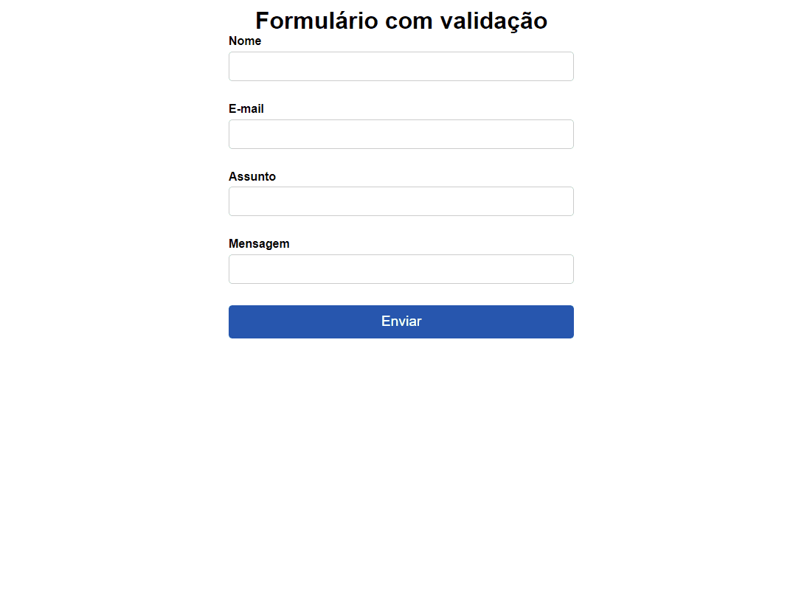

# Formulário com validação
é um formulário muito usado nos projetos de hoje em dia, validações com javascript e no lado do servidor ter controle sobre os dados que são enviados

## Objetivo
Ao clicar em enviar ele dispara as validações, quando preenchido e envia novamente, ele tira a validação. Algumas metogologias utilizadas:
- HTML
- CSS
- Funções e Eventos
- Condicional

## Funcionalidade
[]

## Tecnologias utilizadas 
- HTML
- CSS
- JavaScript
- Git 